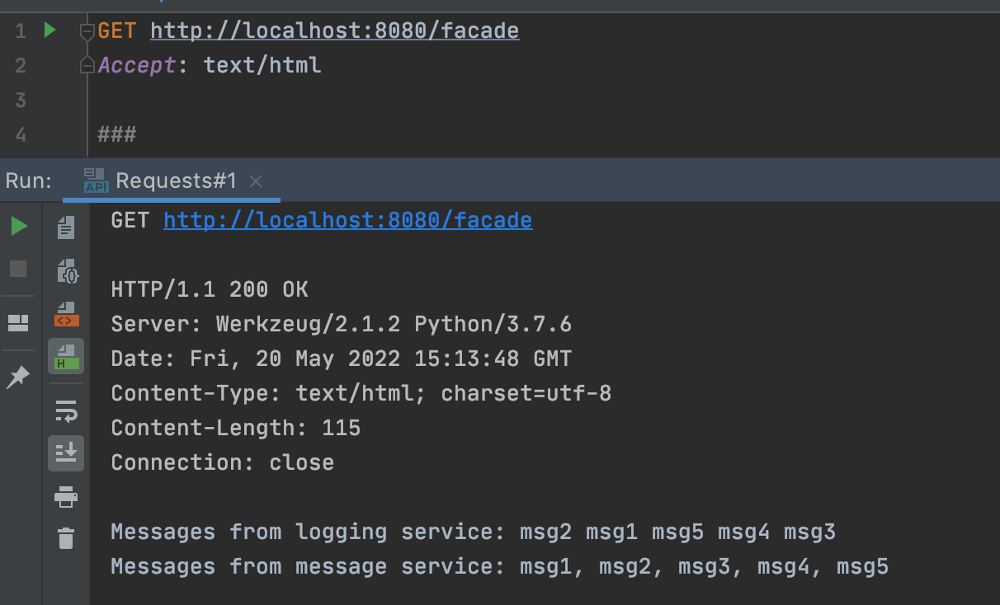
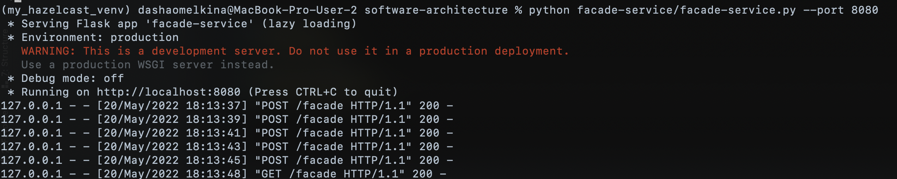
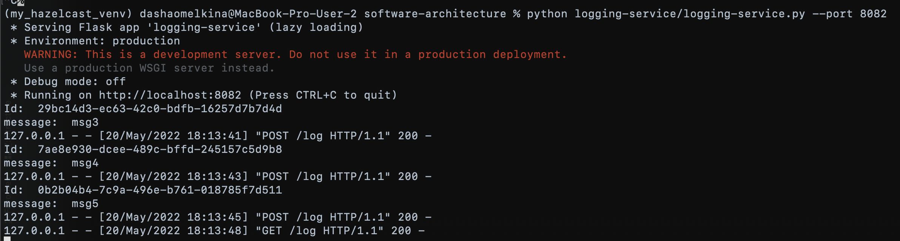
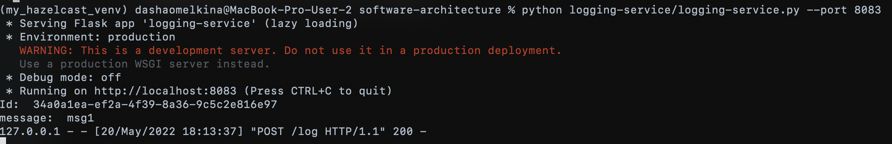
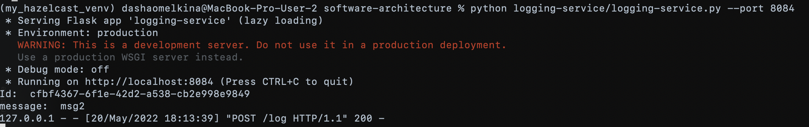
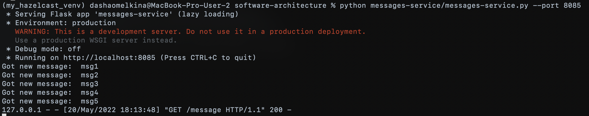
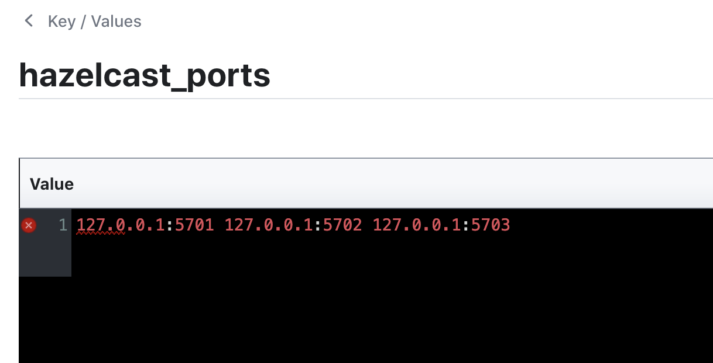

# HW 5: Consul

## Requirements
The following command installs all necessary packages:
```bash
pip install -r requirements.txt
```

### Usage
Consul installation:
```
bash scripts/run_consul.sh
```

To start hazelcast:
```
hazelcast-5.1.1/bin/hz start
```

Run one instance of facade service, one of messaging and three of logging:
```bash
python facade-service/facade-service.py --port 8080
python logging-service/logging-service.py --port 8082
python logging-service/logging-service.py --port 8083
python logging-service/logging-service.py --port 8084
python messages-service/messages-service.py --port 8085
python messages-service/messages-service.py --port 8086
```

To shutdown Consul:
```
bash scripts/stop_consul.sh
```
### Test
Execute the GET/POST requests from [Requests.http](https://github.com/romanyshyn-natalia/software-architecture/blob/micro_basics/facade-service/Requests.http) file.

## Results
We created three logging service instances, two message service instances, and send 5 messages to facade service.

GET result:


Facade log:


Logging log:




Messages log:


Consul data example:
