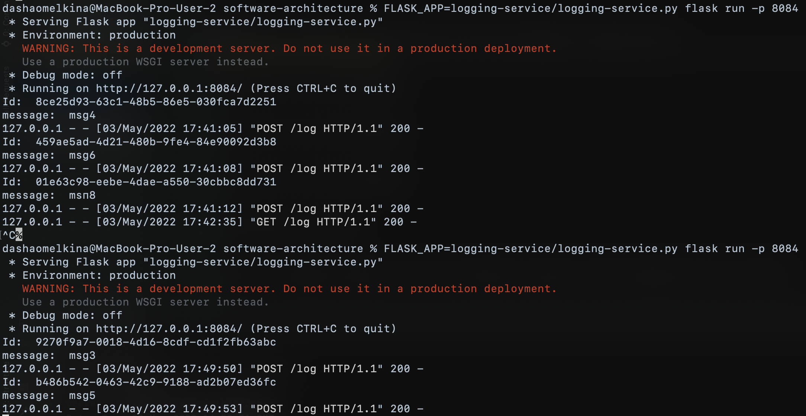
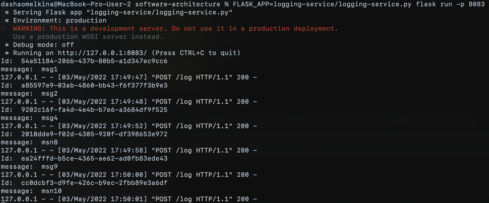
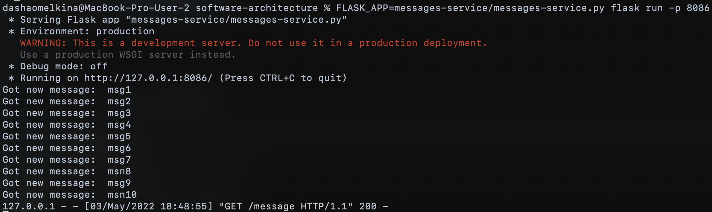
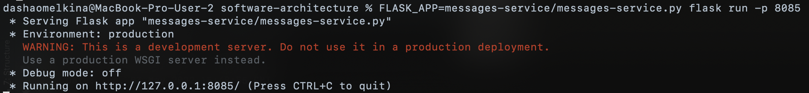
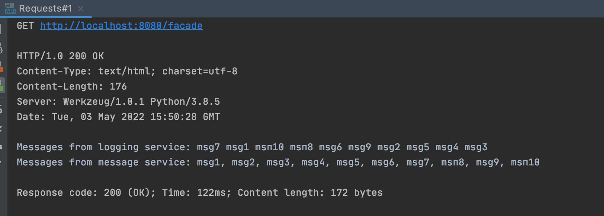

# HW 4: Basic architecture of microservices

## Requirements
The following command installs all necessary packages:
```bash
pip install -r requirements.txt
```

### Usage
Run one instance of facade service, one of messaging and three of logging:
```bash
FLASK_APP=facade-service/facade-service.py flask run -p 8080
FLASK_APP=logging-service/logging-service.py flask run -p 8082
FLASK_APP=logging-service/logging-service.py flask run -p 8083
FLASK_APP=logging-service/logging-service.py flask run -p 8084
FLASK_APP=messages-service/messages-service.py flask run -p 8085
FLASK_APP=messages-service/messages-service.py flask run -p 8086
```

### Test
Execute the GET/POST requests from [Requests.http](https://github.com/romanyshyn-natalia/software-architecture/blob/micro_basics/facade-service/Requests.http) file.

## Results
We created three logging service instances, two message service instances, and send 10 messages to facade service.

Logging service 1 got such messages:


Logging service 2 got such messages:


Logging service 3 got such messages:


Message service 1 got such messages:


Message service 2 got such messages:


Reading messages from facade:

