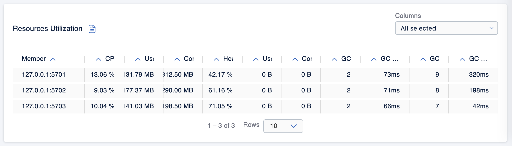
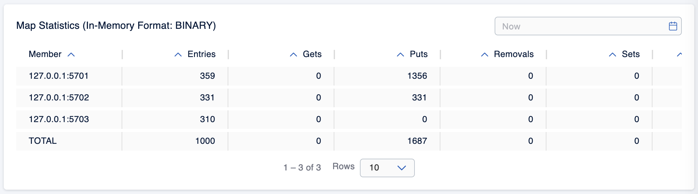
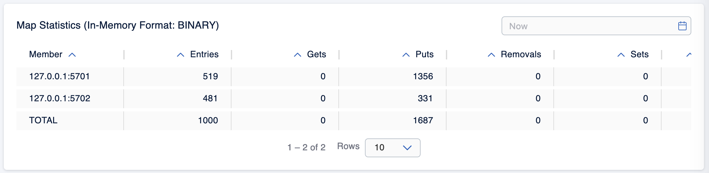
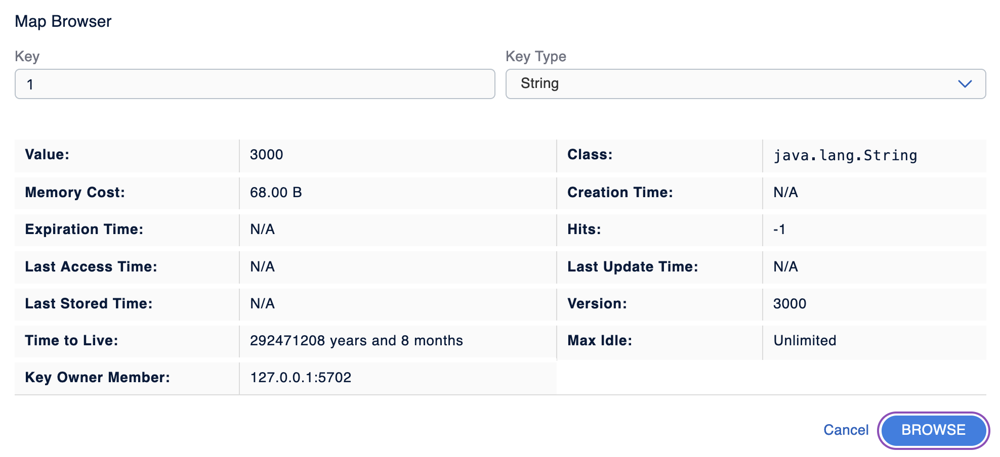
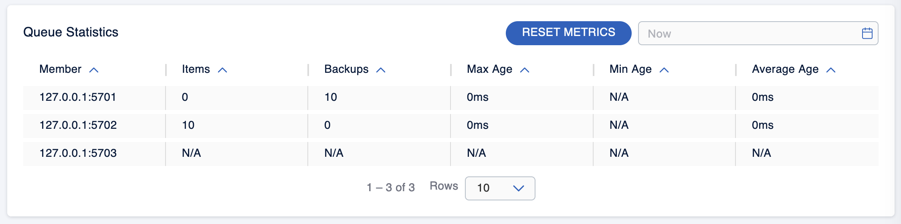

# HW 2: Deployment and work with distributed in-memory data structures based on Hazelcast: Distributed Map

Task results:
### Task 1
We installed Hazelcast.

### Task 2
3 nodes:


### Task 3
Code in [task3/dist_map.py](task3/dist_map.py).

Data in nodes before deleting 3rd node:


After deleting 3rd node:


### Task 4
Code in [task4/](task4).

No locks:


Pessimistic locking:


Optimistic locking:


### Task 5
Into Hazelcast config file (hazelcast.xml) for bounding we added following lines:
```
<queue name="my-distributed-queue">
        <max-size>10</max-size>
</queue>
```

When we only have writing into queue (we bounded it by 10), we see such results:


We used blocking queue, so it did not stop, it was just waiting for free spots in the queue.

After we started two reading clients, they took out all the values (they took different values, no data races and such) 
and writer could write all the 1000 values into queue. After readers took all the values, queue became empty.
Reader 1:


Reader 2: 

